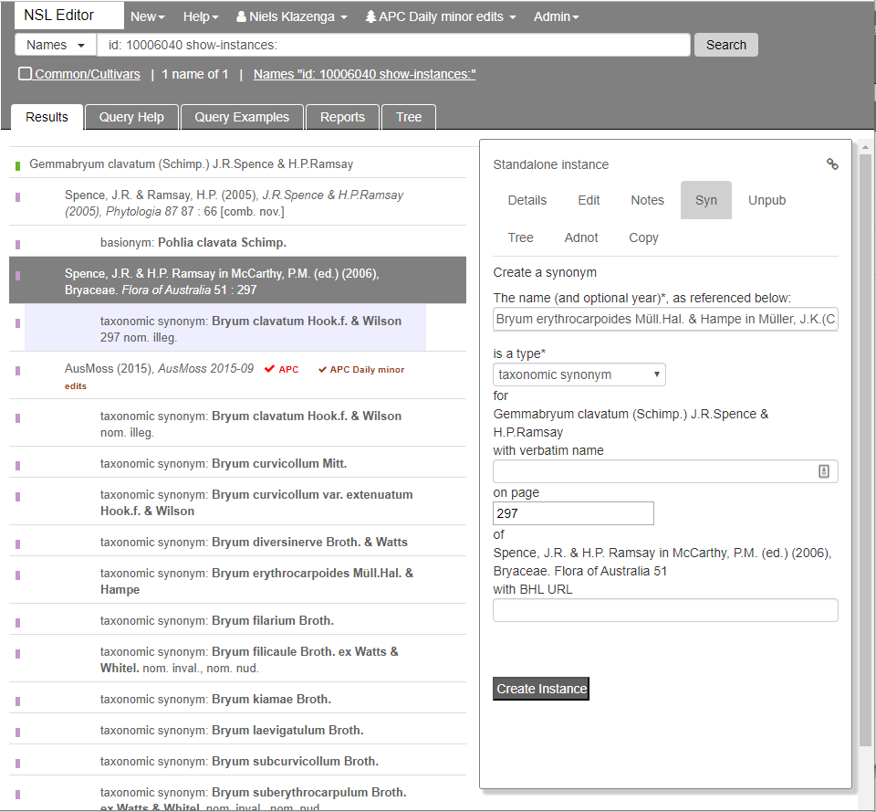

# New instance

You can create a new instance in the 'New instance' tab in the dialogue for the Name.

::: tip Note
You can create a new instance for a Reference as well, but you'll run into trouble later if you want to add synonyms, as that can only be done when coming in from the Name
:::

- Find the reference by typing the surname of the first author and the year. Select the correct reference from the drop-down list. If the reference is not in the system, [create a new reference](/new-reference) first.

- Select 'secondary reference' from the **as an instance type&ast;** pick list.

  ::: tip Note
  As AusMoss considers the primary instances an extension of the name all "true" instances in AusMoss are secondary instances. See [Add protologue](/new-name/#add-protologue)) on the [New name](/new-name) page to see how to create protologue instances.
  :::

- Add a page number, if relevant.

- If the name in the reference is spelt differently from the canonical spelling, you can provide the name precisely as spelt in the reference in the **with verbatim name** field.

  ::: tip
  I only provide the verbatim name string for *tax. nov.* protologue instances (and only if the original spelling is different from the spelling that is now considered correct under the Code).
  :::

## Add a synonym

You can add a synonym in the **Syn** tab of the **Instance** dialogue.

- Start typing the name of the synonym in the **The name... as referenced below** field and select the instance from the drop-down list. Make sure you pick a protologue instance.

- Select 'taxonomic synonym' from the **is a type** pick list.

  ::: tip Note
  We also use the 'taxonomic synonyms' type for invalid names, even though invalid names cannot strictly be synonyms.
  :::

  ::: warning Note
  We only ever use the 'taxonomic synonym' instance type for relationship instances of secondary reference instances. 
  
  - The 'basionym' and 'replaced synonym' instance types are used for protologue instances only. 
  
  - Nomenclatural synonyms are nomenclatural synonyms no matter what a particular publications says (they are also called objective synonyms), so we don't rely on authors to list them or AusMoss editors to type them in, but infer them from the basionym.

  - There is no place in AusMoss for 'pro-parte synonyms', 'misapplications', 'pro-parte misapplications' etc. "Misapplications" are better dealt with with the RCC-5 ('is congruent with', 'includes', 'is included in', 'overlaps' and 'excludes') relationships, which are not yet implemented in the NSL, but might be implemented soon.
  :::

- You can add the page, if you want (I mostly do).

- You can add the verbatim name string (I don't).

- Click on **Create instance**, refresh the page and you're done.